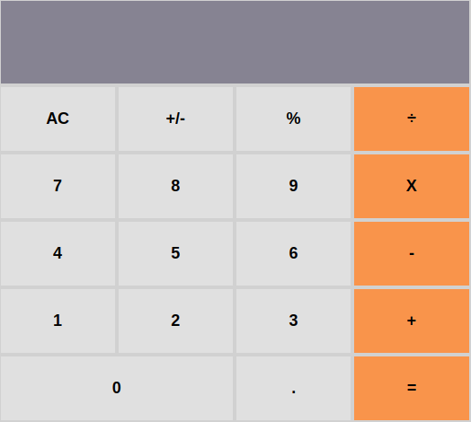

<h1 align="center">Welcome to Calculator App 👋</h1>
<p>
  
  <a href="https://twitter.com/abruzy01" target="_blank">
    
  </a>
</p>

> A Simple Calculator App built using React that uses packages like [big.js](https://www.npmjs.com/package/big-js) for performing arithmetic operation and [prop-types](https://www.npmjs.com/package/prop-types) that check the type of props passed to the child component and validate that.



## Built With

- Major languages - JavaScript, HTML5, scss,
- frameworks - ReactJS

### ✨ Live Demo

[Live Demo Link](https://react-calcapp.herokuapp.com/)

## Getting Started

To get a local copy up and running follow these simple steps.

### Prerequisites

- nodejs must be installed on devic

### Install

- Follow this steps according to get you running

1. clone the repo

```sh
git clone git@github.com:abruzy/react-calculator.git
```
2. change directory 
```sh
cd react-calculator
```

3. install dependencies

```sh
yarn install
```

4. start the project

```sh
yarn start
```

## Author

👤 **Abubakar Diallo**

* Twitter: [@abruzy01](https://twitter.com/abruzy01)
* Github: [@abruzy](https://github.com/abruzy)
* LinkedIn: [@abubakardiallo](https://linkedin.com/in/abubakardiallo)

## 🤝 Contributing

Contributions, issues and feature requests are welcome!

Feel free to check the [issues page](https://github.com/abruzy/react-calculator/issues).

## Show your support

Give a ⭐️ if you like this project!

## Acknowledgments

- [Microverse](https://www.microverse.org/)

## 📝 License

This project is [MIT](lic.url) licensed.